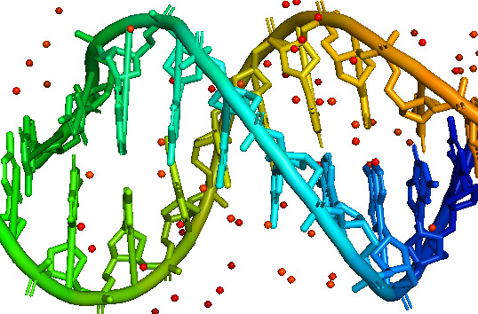
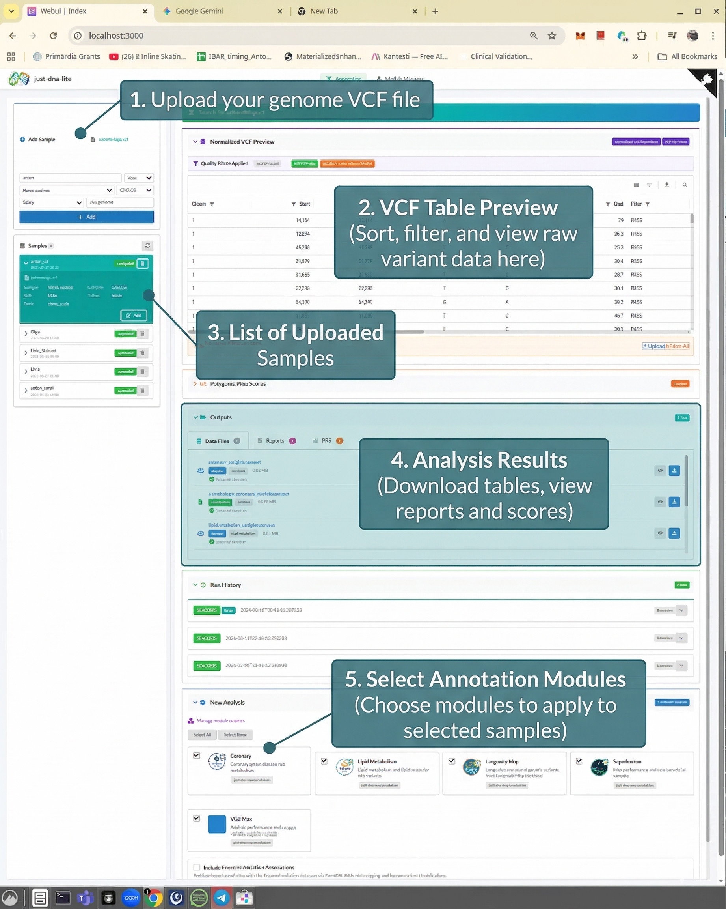

# just-dna-lite

**Understand your DNA. Privately. On your own machine.**

[](LICENSE)
[](https://www.python.org/downloads/)
[](https://github.com/dna-seq/just-dna-lite)



Upload your genome, pick what you want to know, get results in minutes. Other annotation tools can take hours. just-dna-lite runs locally on Polars and DuckDB, so your whole VCF gets normalized, annotated, and reported while you're still making coffee. Your data never leaves your machine.

## What's inside

The tool ships with annotation modules for longevity, coronary artery disease, lipid metabolism, VO2 max, athletic performance, and pharmacogenomics (PharmGKB). These are a starting point. The real idea is that modules are easy to create and the list will grow fast.

**5,000+ Polygenic Risk Scores** from the [PGS Catalog](https://www.pgscatalog.org/) are available out of the box. Pick any score, click compute, and get your result with percentile ranking against 1000 Genomes reference populations. No command line, no scripting, just a few clicks.

**AI Module Creator.** Got a research paper about a trait that interests you? Upload the PDF (or just describe the trait), and a multi-agent team powered by Google Gemini reads the literature, extracts variants with effect weights, cross-checks them, and produces a ready-to-use annotation module. This is how most new modules will be created going forward.

**Self-exploration.** Even without a specific module, you can browse your full variant table with sorting, filtering, and search. Cross-reference against [Ensembl](https://www.ensembl.org/) for clinical significance labels. Export everything as Parquet for your own analysis in Python, R, or any tool that reads Arrow.

## Quick start

You need a VCF file from whole genome (WGS) or whole exome (WES) sequencing aligned to GRCh38, and Python 3.13+. If you sequenced through [Nebula Genomics](https://nebula.org/), [Dante Labs](https://www.dantelabs.com/), [TruDiagnostic](https://trudiagnostic.com/), or a clinical lab, you should have a `.vcf` or `.vcf.gz` file. That's what you need. (23andMe and AncestryDNA produce microarray data, not VCFs. Microarray support is on the roadmap.)

First, install [uv](https://github.com/astral-sh/uv) (a fast Python package manager):

```bash
# Linux / macOS
curl -LsSf https://astral.sh/uv/install.sh | sh

# Windows (PowerShell)
powershell -ExecutionPolicy ByPass -c "irm https://astral.sh/uv/install.ps1 | iex"
```

Then clone and run:

```bash
git clone https://github.com/dna-seq/just-dna-lite.git
cd just-dna-lite
uv sync
uv run start
```

Open the URL printed in the terminal (usually `http://localhost:3000`). Upload your VCF and start exploring.

To use the AI Module Creator, copy `.env.template` to `.env` and add your Gemini API key (free at [Google AI Studio](https://aistudio.google.com/apikey)). Everything else works without it.

## How it works

You upload a VCF through the web interface. The pipeline normalizes it (quality filtering, chromosome prefix stripping, Parquet conversion), then matches your variants against whichever modules you've selected. Each module is a curated database of variants with effect weights from published research. Results come back as downloadable PDF/HTML reports. The whole process takes minutes, not hours.

For Polygenic Risk Scores, the tool pulls scoring files from the PGS Catalog, computes your score, and ranks it against five 1000 Genomes superpopulations (European, African, East Asian, South Asian, American).

All outputs are Parquet files. Open them in Polars, Pandas, DuckDB, R, or anything that speaks Arrow.

## Running individual components

```bash
uv run start             # Full stack (Web UI + pipeline)
uv run ui                # Web UI only
uv run dagster-ui        # Dagster pipeline UI only
uv run pipelines --help  # CLI tools
```

## For bioinformaticians

The project is a [uv workspace](https://docs.astral.sh/uv/concepts/workspaces/) with two packages: `just-dna-pipelines` (Dagster assets, VCF processing, annotation logic, CLI) and `webui` (Reflex web UI, pure Python).

The pipeline runs on [Dagster](https://dagster.io/) with Software-Defined Assets, giving you automatic data lineage and resource tracking (CPU, RAM, duration). Data processing uses [Polars](https://pola.rs/) by default, with [DuckDB](https://duckdb.org/) for streaming joins when memory is tight. VCF reading goes through [polars-bio](https://github.com/polars-contrib/polars-bio). PRS computation comes from [just-prs](https://pypi.org/project/just-prs/) with reusable [prs-ui](https://pypi.org/project/prs-ui/) Reflex components.

Annotation modules are auto-discovered from any [fsspec](https://filesystem-spec.readthedocs.io/)-compatible URL (HuggingFace, GitHub, S3, HTTP). Sources and quality filters live in `modules.yaml` at the project root. No Python code needed to add new modules.

For architecture, pipeline details, and configuration, see the [docs](#documentation).

## Just-DNA-Seq vs Just-DNA-Lite

just-dna-lite is a ground-up rewrite of [Just-DNA-Seq](https://just-dna.life/). The original used OakVar and took hours per VCF. The rewrite drops OakVar in favor of Dagster + Polars/DuckDB and finishes in seconds. The web UI moved from OakVar's viewer to [Reflex](https://reflex.dev/) (pure Python, no JavaScript). Data lineage is automatic. And adding new modules went from "write Python code" to "upload a paper and let the AI handle it."

## Testing

```bash
uv run pytest                           # All tests
uv run pytest just-dna-pipelines/tests/ # Pipeline tests only
```

## Documentation

- [Architecture Overview](docs/ARCHITECTURE.md)
- [AI Module Creation](docs/AI_MODULE_CREATION.md) — DSL spec, compiler, registry API, Agno agent (solo + team), module discovery
- [Dagster Pipeline Guide](docs/DAGSTER_GUIDE.md)
- [Annotation Modules](docs/HF_MODULES.md)
- [Configuration & Setup](docs/CLEAN_SETUP.md)
- [Design System & UI Architecture](docs/DESIGN.md)

## Roadmap

GRCh38 VCF files (WGS and WES) are fully supported, along with PRS and AI-assisted module creation. GRCh37/hg19 support, T2T reference genomes, microarray data (23andMe, AncestryDNA), and multi-species support are planned but not yet available.

## Related projects

- [just-prs](https://github.com/antonkulaga/just-prs) — Polygenic Risk Score library and UI ([PyPI](https://pypi.org/project/just-prs/))
- [prepare-annotations](https://github.com/dna-seq/prepare-annotations) — upstream pipeline for Ensembl and module annotation data
- [Just-DNA-Seq](https://just-dna.life/) — the original project

## License

AGPL v3. See [LICENSE](LICENSE).

## Contributors

[Anton Kulaga](https://github.com/antonkulaga) (IBAR) and Nikolay Usanov (HEALES), with contributions from the [Just-DNA-Seq](https://github.com/dna-seq) community.
