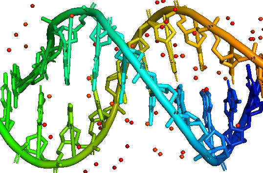
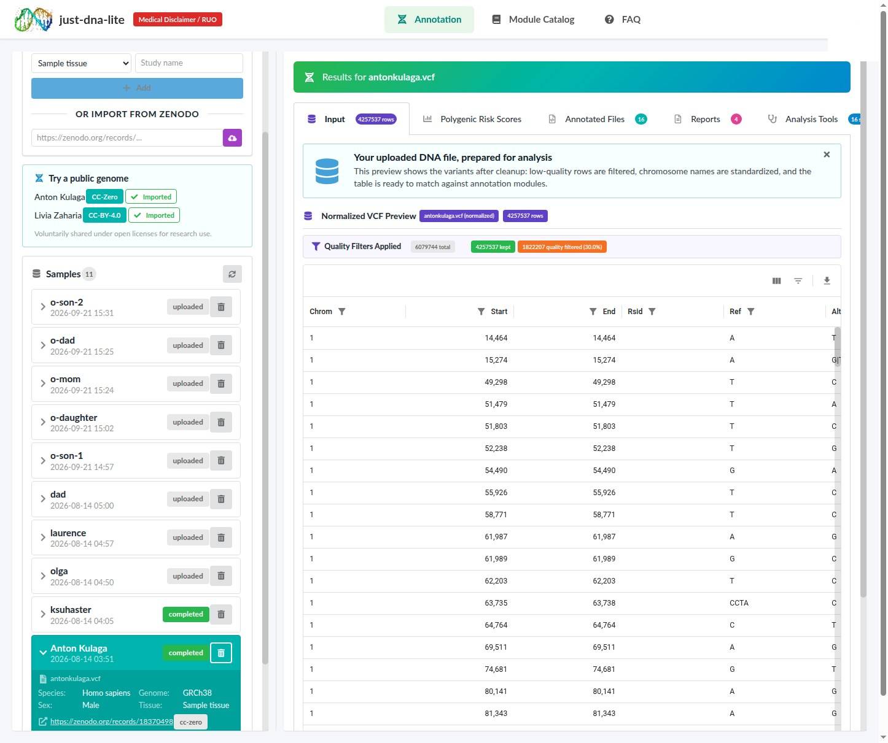

# just-dna-lite

**Your genome, your data, your call.**

[](LICENSE)
[](https://www.python.org/downloads/)
[](https://github.com/dna-seq/just-dna-lite)



[](https://www.youtube.com/watch?v=NcOiEUaIpUk)

Upload a genome file, pick a topic, and read a report in ordinary language. The app runs on your computer. The file stays there.

The topics that come with it cover longevity, heart disease, cholesterol, fitness, and clotting. You can install more from the [public catalog](https://module-registry.just-dna.life). You can also write a new topic from a paper, with an assistant, and run it on the same file. That assistant is [just-module-creator](https://github.com/dna-seq/just-module-creator).

Some results are one position. Others are several positions read together. A blood group is the clear case: the report gives you one result in a sentence. APOE type and a drug-response class can be written the same way. When the file cannot decide, the report says so, and names the possibilities.

Thousands of polygenic scores from the [PGS Catalog](https://www.pgscatalog.org/) sit next to those topics. A score adds up many small genetic clues and places you on a chart of reference genomes.

If you would rather add a topic than click through one, a module is a folder of tables. People who want to work on the app itself can start at [For contributors](#for-contributors).

## Try it

You need a genome file from whole-genome or whole-exome sequencing, the kind companies such as [DNA Complete](https://dnacomplete.com/), [Dante Labs](https://www.dantelabs.com/), and [Sequencing.com](https://sequencing.com/) let you download. Look for a file ending in `.vcf` or `.vcf.gz`. We are not affiliated with those companies.

No file of your own yet? Two of the authors published theirs. Paste either link into **Import from Zenodo**, or download it and upload it.

- **Anton Kulaga** (CC-Zero): [zenodo.org/records/18370498](https://zenodo.org/records/18370498)
- **Livia Zaharia** (CC-BY-4.0): [zenodo.org/records/19487816](https://zenodo.org/records/19487816)

Other public genomes are on [Open Humans](https://www.openhumans.org/). If you are in Romania, the [ROGEN project](https://rogen.umfcd.ro/) is sequencing thousands of people and sometimes recruits participants.

It runs on Linux, macOS, and Windows the same way. Install [uv](https://github.com/astral-sh/uv) once, then:

```bash
git clone https://github.com/dna-seq/just-dna-lite.git
cd just-dna-lite
uv sync
uv run start
```

Open the address the terminal prints, usually `http://localhost:3000`.

<details>
<summary><strong>First-time setup, and when <code>uv run start</code> complains</strong></summary>

**git** has to be installed. macOS and most Linux machines already have it. On Windows, if `git --version` fails, install it from [git-scm.com/install/windows](https://git-scm.com/install/windows) and open a new terminal.

**uv**, once:

```bash
# Linux / macOS
curl -LsSf https://astral.sh/uv/install.sh | sh

# Windows (PowerShell)
powershell -ExecutionPolicy ByPass -c "irm https://astral.sh/uv/install.ps1 | iex"
```

Close the terminal and open a new one afterwards, or the shell will not see `uv` yet.

**Python 3.13**, managed by uv so it does not replace the system Python:

```bash
uv python install 3.13
```

**Node.js 22.22 or newer** is what `uv run start` uses for the web interface. Check with `node --version`. If it is missing or older, install the current LTS from [nodejs.org](https://nodejs.org) (on Windows: `winget install OpenJS.NodeJS.LTS`) and open a new terminal. If you cannot upgrade Node, `uv run serve` runs the app without that development server.

**A work laptop that blocks `start.exe`.** Some managed Windows machines refuse the small helper `uv` writes. Run the same command through Python:

```bash
uv run python -m just_dna_lite.cli start
```

**A single process, for a demo or a workshop:**

```bash
uv run serve
```

`uv run kill-ports` clears a leftover server if the port is already taken.

**Apple Silicon, when native libraries complain.** The Nix flake pins Python, Node, and uv for that machine:

```bash
sh <(curl -L https://nixos.org/nix/install)
mkdir -p ~/.config/nix
echo "experimental-features = nix-command flakes" >> ~/.config/nix/nix.conf
cd just-dna-lite
nix develop
uv sync
uv run start
```

</details>

<details>
<summary><strong>Podman or Docker, if you would rather not install Python</strong></summary>

The container still runs on your machine. [Podman](https://podman.io/) is the better default for a personal genome file, because it does not need root. Docker works the same way if you already have it: swap `podman` for `docker`.

```bash
git clone https://github.com/dna-seq/just-dna-lite.git
cd just-dna-lite
mkdir -p my_genomes
# put your .vcf or .vcf.gz files in my_genomes/
podman-compose up --build
```

With Docker Compose the last line is `docker compose up --build`. Open `http://localhost:3000`. Reports land in `my_results/`. The first Ensembl cross-check, if you turn it on, downloads about 14 GB into a volume that survives restarts.

There is no prebuilt image to pull yet. Compose builds it from this repository.

</details>

<details>
<summary><strong>Chip files from consumer tests, and the command line</strong></summary>

23andMe, AncestryDNA, and MyHeritage read a few hundred thousand chosen positions. The app can take those files, and the report will be much thinner than one from a whole genome. Whole-genome and whole-exome files on the GRCh38 reference are the path this was built for. Older GRCh37 files can be lifted. A T2T reference is still planned.

```bash
uv run pipelines list-modules
uv run annotate anton -m longevitymap
uv run annotate path/to/genome.vcf.gz -m thrombophilia -m coronary
uv run pipelines annotate genome.vcf --all-modules --ensembl
```

`anton` and `livia` are the public genomes above, so you can try a report without a file of your own. `uv run pipelines ensembl-setup` downloads the Ensembl database (about 14 GB) before the first cross-check, if you would rather do that while you have a quiet connection.

</details>

## Before you read a result as news

This is a research tool for learning, citizen science, and teaching. A health decision belongs with a clinician or a genetic counsellor. The modules, including ones an assistant drafted from a paper, are provided as they are.

A red label is common in healthy people. Reference projects find that an ordinary genome carries many variants some database once called pathogenic. A polygenic score is a place on a chart, mostly built from European studies, so the chart fits some ancestries better than others. Lifestyle often moves a common disease more than any single common variant.

If a finding matches a real family history and you are worried, the next step is a doctor and a clinical test.

<details>
<summary><strong>Heritability, scores, and why a database label is not a diagnosis</strong></summary>

"70% heritable" describes how much of the *difference between people in one study* lined up with genetic differences. Change the environment and the number moves. Height is highly heritable where children are well fed, and less so where they are not. The genes did not change.

A polygenic score multiplies each listed variant by a weight from a study and adds them up. The biology underneath is not a sum. Many of the variants are neighbors of a cause, tagged along because they travel with it. The original studies tend to overstate the size of the effect.

The longer version, including when a clinical lab would and would not act, is [Understanding Your Genome](docs/SCIENCE_LITERACY.md).

</details>

## Write a topic, or help build the app

A topic you care about can become a module: claims, each tied to a paper, compiled into something this app can run. [just-module-creator](https://github.com/dna-seq/just-module-creator) is the assistant for that. You bring the question and the sources. It reads them, writes the rows, and checks them. If you want to see the result on a real genome, say so. It can connect this app and ask which files to use.

Combination topics (a blood group, an APOE type) are a different shape from a list of single variants. The report is written for two readers at once: a person with no science background, and a professional who wants the identifiers folded underneath. The rules for that voice are in [docs/REPORT_VOICE.md](docs/REPORT_VOICE.md).

## For contributors

<details>
<summary><strong>Layout, tests, and the neighbouring projects</strong></summary>

The repository is a [uv workspace](https://docs.astral.sh/uv/concepts/workspaces/). `just-dna-pipelines` is the annotation pipeline and the command line. `webui` is the browser app, written in Python. Tests:

```bash
uv run pytest
uv run pytest just-dna-pipelines/tests/
```

A module the app can run is described in [docs/HF_MODULES.md](docs/HF_MODULES.md). How a combination such as a blood group is called from a genome file is [docs/PHENOTYPE_CALLS.md](docs/PHENOTYPE_CALLS.md). The pipeline, the local MCP server, and the layout of the app:

- [Architecture](docs/ARCHITECTURE.md)
- [Pipeline guide](docs/DAGSTER_GUIDE.md)
- [MCP server](docs/MCP_SERVER.md)
- [FAQ](docs/FAQ.md)
- [Setup](docs/CLEAN_SETUP.md)

This app is a rewrite of [Just-DNA-Seq](https://just-dna.life/). The same family of projects:

- [just-module-creator](https://github.com/dna-seq/just-module-creator) writes modules with an assistant
- [just-prs](https://github.com/dna-seq/just-prs) computes the polygenic scores
- [just-dna-compiler](https://github.com/dna-seq/just-dna-compiler) is the module format and the compiler
- [just-dna-registry](https://github.com/dna-seq/just-dna-registry) is the catalog

</details>

## Funding

Open source, for anyone. One of the core developers, [Anton Kulaga](https://github.com/antonkulaga), is funded through the [ROGEN consortium](https://rogen.umfcd.ro/). Recruitment there is still going, so Romanian-calibrated scores and the related public-health work are research directions, not finished results.

## License

AGPL v3. See [LICENSE](LICENSE).

The software is provided as is, without warranty. The authors and contributors accept no liability for what anyone does with a result. Read the note [above](#before-you-read-a-result-as-news) before you treat a screen as news about your health.

## Contributors

[Anton Kulaga](https://github.com/antonkulaga) (IBAR) and Nikolay Usanov (HEALES), with the [Just-DNA-Seq](https://github.com/dna-seq) community.
