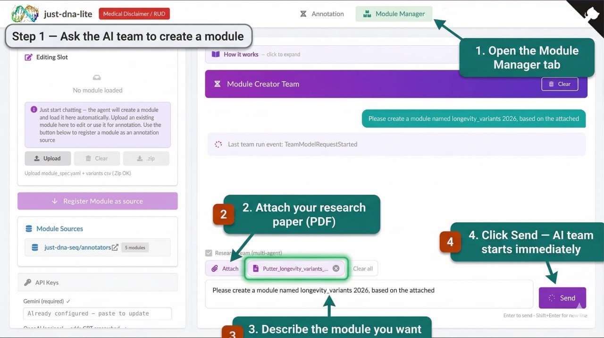
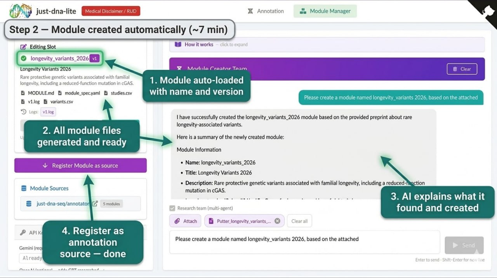

# just-dna-lite Workshop — RoBioinfo 2026

**Proposed for:** [RoBioinfo 2026](https://rsbi.ro/evenimente/robioinfo2026/), Timișoara, Romania, 13–15 May 2026  
**Repository:** [github.com/dna-seq/just-dna-lite](https://github.com/dna-seq/just-dna-lite)  
**Instructors:** Anton Kulaga (core developer, Institute of Biochemistry of the Romanian Academy — IBAR) and Livia Zaharia (HEALES — Healthy Life Extension Society)  
**Format:** Hands-on workshop — **offline (in-person)** · adaptable for online/hybrid  
**Duration:** 90 minutes core workshop, or 110 minutes with the optional introductory block — see [Optional +20 min: Introduction to Genomics, Longevity, and Interpretation](#optional-20-min-introduction-to-genomics-longevity-and-interpretation)  
**Audience:** Bioinformaticians, computational biologists, wetlab researchers, longevity researchers, and biology students. Experienced participants can jump straight into the core 90-minute session. For those with solid biology background but less exposure to genome file formats or quantitative genetics, an optional 20-minute introduction covers VCF structure and interpretation basics. No prior command-line experience is required — the web UI is the primary interface.  
**Platforms:** Linux · macOS · Windows · Windows (WSL) — requires Python 3.13+ and [uv](https://github.com/astral-sh/uv)  
**What to bring:** Own laptop with the software pre-installed (see [Setup Instructions](#setup-instructions)). The Ensembl cache (~14 GB) must be downloaded before the workshop — instructors will have USB sticks as a fallback.  
**Internet:** Required during the session for the AI Module Creator (LLM API calls) and PGS Catalog queries. Annotation against pre-cached modules and Ensembl works offline.  
**Demo genome:** Anton Kulaga's public genome on [Zenodo record 18370498](https://zenodo.org/records/18370498); Livia Zaharia's genome available as a second sample. Participants can also bring their own genomes as VCF files, however they must be hg38 and be full genomes or exomes.

---

> ### ⚠️ Critical Pre-requisite for Participants
>
> The **Ensembl variant annotation** and **AI Module Creator** segments require the Ensembl variation cache (~14 GB) to be present on each participant's machine **before** arriving.
> This download takes **30–60 minutes on a fast connection** and cannot be done in-room without disrupting the session.
>
> **Participants must run `uv run pipelines ensembl-setup` at home before the workshop.**
>
> **Offline advantage:** Instructors can bring the cache pre-loaded on USB sticks with predownloaded cache (~14 GB). Participants who skipped the pre-download can copy from USB and set `JUST_DNA_PIPELINES_CACHE_DIR` in `.env`.  
> *This USB fallback is only practical in-person — for online workshops there is no equivalent.*

---

## Contents

1. [Workshop Description](#workshop-description)
2. [Learning Objectives](#learning-objectives)
3. [Timetable](#timetable)
4. [AI Module Creator — Practical Guidance](#ai-module-creator--practical-guidance-min-60--85)
5. [Minimal Module Format](#minimal-module-format)
6. [Setup Instructions](#setup-instructions)
7. [Pre-workshop Cache Downloads (Instructor)](#pre-workshop-cache-downloads-instructor)
8. [Optional Stretch Goals](#optional-stretch-goals)
9. [Instructor Notes](#instructor-notes)
10. [Optional +20 min: Introduction to Genomics, Longevity, and Interpretation](#optional-20-min-introduction-to-genomics-longevity-and-interpretation)

---

## Workshop Description

A hands-on session where participants annotate a real whole-genome file using [just-dna-lite](https://github.com/dna-seq/just-dna-lite), an open-source genome annotation tool that runs locally through a web interface. Whole-genome sequencing produces a VCF (Variant Call Format) file — a large table listing every position where the sample's DNA differs from the reference genome. S. In the workshop, participants take that file and work through the full annotation flow: upload a VCF, normalize it, run built-in annotation modules (with a focus on longevity), inspect flagged variants against Ensembl and ClinVar, compute a polygenic risk score from the PGS Catalog, and build a new annotation module from a published paper using the AI Module Creator — an LLM-based agent that reads a GWAS or pharmacogenomics article, extracts variants and effect directions, and produces a ready-to-use module. All outputs are exported as Parquet for downstream analysis. Everything runs on the participant's own machine.

Each participant leaves with a working local installation, the annotated outputs, and practical experience with interpreting these results — including their limitations, particularly in the longevity space where effect sizes are small and replication is still catching up. The scope is research-oriented; the workshop does not cover clinical interpretation or diagnostic workflows.

The workshop is useful across several participant profiles:

- **People who have their own genome data** — whether from consumer whole-genome sequencing, a research study like ROGEN, or a collaborator — and want to actually explore and annotate it themselves
- **Genomics and longevity researchers** who want a practical local workflow for variant annotation and polygenic scoring on their data
- **Wetlab biologists, biochemists, and other adjacent scientists** who want hands-on familiarity with VCF files, variant annotation, and what polygenic scores look like in practice
- **AI/ML researchers** interested in how LLM agents are applied in bioinformatics — the AI Module Creator segment is a concrete example of automated literature extraction and structured data generation
- **Students** in biology, bioinformatics, or computational biology who want to see what genome annotation looks like end to end


---

## Learning Objectives

By the end of this workshop, participants will be able to:

- Upload and normalise a VCF file using the just-dna-lite web interface
- Run built-in annotation modules and read a generated PDF report
- Filter variants by clinical significance using Ensembl/ClinVar annotations
- Build a new annotation module from a published GWAS or pharmacogenomics paper using the AI Module Creator
- Compute and interpret a polygenic risk score from the PGS Catalog
- Export annotated Parquet data and perform a basic Polars query
- Critically evaluate what annotation scores and risk flags actually mean in a population context

---

## Timetable

> The core workshop is 90 minutes. The first row is an optional 20-minute introduction for participants who know biology but have not worked with VCF files or quantitative genetics before. Include or skip it based on the audience — the core session (min 0–90) is self-contained either way.

| Minutes | Segment | What happens |
|---------|---------|--------------|
| *OPTIONAL −20 – 0* | ***Intro to Genomics, Longevity, and Interpretation*** | *What a VCF file actually contains, why one genome produces millions of rows, how `just-dna-lite` converts it to Parquet for filtering and export. Brief orientation on longevity genetics (small effects, heterogeneous cohorts, survival bias) and on what heritability and PRS scores do and do not tell you. Not a basic genetics lecture — aimed at biologists and adjacent scientists who want shared context before the hands-on session. Full outline in [Optional +20 min](#optional-20-min-introduction-to-genomics-longevity-and-interpretation).* |
| **min 0 – 10** | **Setup + VCF Upload** | Install check, upload Anton's (or Livia's) public VCF, watch the normalization job run. During upload, give a concise orientation to the file fields participants will actually use in the interface: chromosome/position, reference vs alternate allele, genotype, depth/quality, and why the app converts VCF to Parquet for filtering and export. |
| **min 10 – 30** | **Built-in Modules + Report** | Run all five built-in modules (`longevitymap`, `coronary`, `lipidmetabolism`, `superhuman`, `vo2max`). Open the generated PDF report. Start with the longevity module to anchor the workshop in the host lab's research context, then compare how different modules present protective, risk, and performance-associated variants. Trace one reported hit back to the underlying Parquet row and source study. |
| **min 30 – 45** | **Ensembl Variant Annotation** | Enable the Ensembl annotation job. Sort and filter the annotated table by `clinical_significance` to surface pathogenic or likely-pathogenic calls. Discuss penetrance vs. flagging: how many variants does a typical healthy genome carry that are labelled "pathogenic" in ClinVar? Compare the demo genome against 1000G background counts. |
| **min 45 – 70** | **AI Module Creator** | Participants upload a PDF of a recent GWAS, longevity, or pharmacogenomics article (GRCh38, with a supplementary variant table). The AI Solo Agent queries EuropePMC and Open Targets (~2–3 min), extracts variants, and generates `variants.csv` + `module_spec.yaml`. Participants inspect the output, register the module, re-run annotation, and verify that at least one variant from their article appears in the new report section. |
| **min 70 – 82** | **PRS in Practice** | Open the PRS section, pick one score from the PGS Catalog, compute it, and read the percentile output. Use this as the practical bridge to explain what a population-ranked score is and what it is not, without turning the core workshop into a theory lecture. |
| **min 82 – 90** | **Q&A + Export** | Download the annotated Parquet, show a 3-line Polars query in the terminal, and close with discussion: what module would you build for longevity research, what would you validate before trusting it, and which findings deserve follow-up rather than immediate interpretation? |

---

## AI Module Creator — Practical Guidance (min 45 – 70)

Participants should bring (or will be provided) a recent article and its supplementary material that:

- Reports genetic associations (GWAS, candidate gene study, or pharmacogenomics)
- Uses **GRCh38** coordinates or rsIDs (most post-2019 papers qualify)
- Includes a table of variants with effect alleles and direction of effect

**Good candidate topics:** longevity, cardiovascular risk, metabolic traits, neurological conditions, pharmacogenomics (drug response), athletic performance. If participants do not bring their own article, instructors will provide a curated set of recent open-access papers.





> **Timing:** Solo Agent takes ~2–3 minutes (~160 s observed in logs). Team mode (multi-agent consensus) takes **7+ minutes** per run — too long to fit in this slot.

**Team mode kick-off strategy:** To demo multi-agent consensus, launch Team mode at the very start of the Built-in Modules segment (min 10) while participants read their first PDF report. By the time the AI Creator block starts (min 45) it will be done or nearly done. Do **not** start Team mode mid-slot and wait — it will consume the entire block.

---

## Minimal Module Format

### `module_spec.yaml`

```yaml
schema_version: "1.0"
module:
  name: my_module
  version: 1
  title: "My Module"
  description: "One-line description."
  report_title: "My Module Report Section"
  icon: dna
  color: "#21ba45"
defaults:
  curator: human
  method: literature-review
  priority: medium
genome_build: GRCh38
```

### `variants.csv` — required columns

| Column | Description |
|--------|-------------|
| `rsid` | dbSNP rsID |
| `genotype` | Slash-separated, alphabetically sorted (e.g. `A/G`) |
| `weight` | Negative = risk, positive = protective (range −1.2 to +1.2) |
| `state` | `risk` / `protective` / `neutral` |
| `conclusion` | ≤50 words |
| `gene` | HGNC symbol |

---

## Setup Instructions

Install [uv](https://github.com/astral-sh/uv), then:

```bash
git clone https://github.com/dna-seq/just-dna-lite.git
cd just-dna-lite
uv sync
uv run start
```

Open the URL printed in the terminal (usually `http://localhost:3000`).

To use the AI Module Creator, copy `.env.template` to `.env` and add a free Gemini API key from [Google AI Studio](https://aistudio.google.com/apikey). Everything else works without any API keys.

> **Getting a Gemini key:** [This short video walkthrough](https://www.youtube.com/watch?v=SbT6WbISBow) shows the exact steps.

> **Mandatory before the workshop:** Run `uv run pipelines ensembl-setup` to pre-download the ~14 GB Ensembl variation cache. Without it, the Ensembl annotation and AI Module Creator segments cannot run.

---

## Pre-workshop Cache Downloads (Instructor)

> **Send these instructions to all participants at least 3 days before the workshop.**  
> The Ensembl cache alone is ~14 GB and takes 30–60 minutes on a fast connection.  
> Without it, two of the four hands-on segments (Ensembl annotation and AI Module Creator) will not work.  
> **Do not rely on venue Wi-Fi for this download.**

### 1. Clone and install

```bash
git clone https://github.com/dna-seq/just-dna-lite.git
cd just-dna-lite
uv sync
```

### 2. Ensembl variation cache — mandatory, ~14 GB

The Ensembl annotation asset needs per-chromosome parquet files from HuggingFace (`just-dna-seq/ensembl_variations`). One command handles download + SHA256 verification + DuckDB build:

```bash
uv run pipelines ensembl-setup
```

Files land in `~/.cache/just-dna-pipelines/ensembl_variations/data/homo_sapiens-chr*.parquet`.

**Verify or resume an interrupted download:**

```bash
# Show what is missing vs the remote manifest
uv run pipelines verify-ensembl

# Resume (already-valid files are skipped automatically)
uv run pipelines ensembl-setup

# Force full re-download (e.g. after corruption)
uv run pipelines ensembl-setup --force
```

**Custom cache location** (shared NAS, classroom server, or USB stick):

```bash
uv run pipelines ensembl-setup --cache-dir /mnt/shared/just-dna-cache
# Participants set the same path in .env:
# JUST_DNA_PIPELINES_CACHE_DIR=/mnt/shared/just-dna-cache
```

**USB stick distribution (offline workshops only):** Copy the completed `~/.cache/just-dna-pipelines/ensembl_variations/` folder onto FAT32/exFAT USB sticks (~14 GB each). After copying, verify integrity with `uv run pipelines verify-ensembl`. This fallback is **not** available for online workshops.

### 3. Demo VCF — Anton Kulaga's public genome (~2–4 GB)

```bash
curl -L -o anton_kulaga.vcf \
    "https://zenodo.org/records/18370498/files/antonkulaga.vcf?download=1"
```

Share via USB or a local HTTP server so participants don't all download simultaneously.

### 4. PGS Catalog metadata (~150–200 MB)

Downloaded automatically on first use of the PRS tab, but you can pre-warm:

```bash
uv run python -c "from just_prs import PRSCatalog; PRSCatalog()"
```

Metadata lands in `~/.cache/just-prs/metadata/` (scores, performance, best_performance parquets).

### 5. API key for AI Module Creator

Get a free Gemini API key at [aistudio.google.com/apikey](https://aistudio.google.com/apikey), then:

```bash
cp .env.template .env
echo 'GEMINI_API_KEY=your_key_here' >> .env
```

A [short video walkthrough](https://www.youtube.com/watch?v=SbT6WbISBow) shows the exact steps. Adding `OPENAI_API_KEY` and/or `ANTHROPIC_API_KEY` enables multi-researcher team mode with 2–3 parallel agents (optional).

### 6. Verify everything is ready

```bash
# Confirm Ensembl parquets are intact (SHA256 check)
uv run pipelines verify-ensembl

# Start the app and confirm it loads
uv run start
# Open http://localhost:3000 — check: Upload tab, PRS tab, Module Manager
```

### Disk space summary

| Asset | Size | Location |
|-------|------|----------|
| Ensembl parquets | ~14 GB | `~/.cache/just-dna-pipelines/ensembl_variations/data/` |
| Ensembl DuckDB | ~5–10 MB | `~/.cache/just-dna-pipelines/ensembl_variations/` |
| PGS Catalog metadata | ~150–200 MB | `~/.cache/just-prs/metadata/` |
| Demo VCF (Zenodo) | ~2–4 GB | your download location |
| Annotation modules | ~50–100 MB | auto-cached by Dagster on first annotation run |

---

## Optional Stretch Goals

For advanced participants or if time allows:

- **HuggingFace module hosting:** push a manually created module to a HuggingFace dataset repo, add the URL to `modules.yaml`, and verify auto-discovery works for other participants.
- **Ancestry-aware PRS:** compute the same score against all five 1000G superpopulations and discuss why European-trained scores behave differently on non-European samples.
- **Longevity deep dive:** filter the `longevitymap` output Parquet to `state = protective` and `weight > 0.5`. Look up the top hit on LongevityMap.org and verify the cited study matches the weight direction in the module.
- **PLINK2 validation:** download a PGS scoring file from pgscatalog.org, run `uv run pipelines compute-prs` and PLINK2 on the same VCF, plot the scores against each other — the r = 0.9999 concordance is a good conversation starter on trust and reproducibility.
- **Pipeline monitoring:** open the Dagster UI, walk through the asset lineage graph, inspect CPU/RAM metadata on each materialized asset — introduce the concept of reproducible auditable pipelines vs. black-box scripts.
- **Parquet export and custom analysis:** download the annotated Parquet and filter it with Polars or DuckDB; filter to `clinical_significance = pathogenic`, count how many variants the 1000G cohort carries in healthy samples, and run the penetrance reality check from the disclaimer segment.

---

## Instructor Notes

- **Disclaimer first:** spend 2–3 minutes on what the numbers mean before participants see their first "pathogenic" flag. Key points: high heritability ≠ high penetrance; PRS is a rank, not a probability; most GWAS hits are tagging SNPs, not causal variants. Full explainer in [docs/SCIENCE_LITERACY.md](SCIENCE_LITERACY.md).

- **Demo genomes:** Anton Kulaga's VCF from Zenodo is the primary shared sample so all participants see the same output during the walkthrough. Livia Zaharia's genome is available as a second demo sample (link to be provided before the conference). Participants can switch to their own VCF during hands-on time.

- **Article selection for AI Creator:** prepare a curated set of 3–5 open-access GWAS or pharmacogenomics papers with supplementary variant tables, all using GRCh38. Distribute as PDFs at the start of the workshop so participants who did not bring their own are not blocked. Aim for papers published after 2019 with 10–200 lead SNPs.

- **AI Creator API keys:** collect Gemini keys from participants in advance or provide a shared key for the workshop session. OpenAI and Anthropic keys are optional but enable the multi-researcher team mode and make a better demo.

- **Ensembl annotation segment:** pre-warm the Ensembl cache the day before (see [Pre-workshop Cache Downloads](#pre-workshop-cache-downloads-instructor)). Without the cache, the Ensembl job triggers a ~10–13 GB download mid-session, which will derail the timetable entirely.

- **PLINK2 stretch goal** is most engaging for bioinformatics-adjacent participants; skip it for general audiences.

---

## Optional +20 min: Introduction to Genomics, Longevity, and Interpretation

> **Default: optional.** Use this block when the audience includes wetlab biologists, longevity researchers, or other participants who know the biology well but do not routinely work with VCF files, GWAS outputs, or genomic interpretation pipelines. Add it before min 0 of the core timetable. Full background in [docs/SCIENCE_LITERACY.md](SCIENCE_LITERACY.md).

This is not a basic genetics lecture and not a primer for laypeople. It is a short practical introduction for biologists who want enough shared context to get more out of the hands-on session.

Start from the file itself. A real genome file is not a neat list of "interesting mutations"; it is a very large table of variant calls, quality fields, and sample-level genotypes. For many participants, the unfamiliar part is not what a SNP is, but what `REF`, `ALT`, `QUAL`, `FILTER`, or genotype fields actually mean in practice when you are staring at a VCF and trying to decide what is worth trusting. This is where the introduction should help. Explain why one genome produces millions of rows, why raw VCF is awkward for exploration, and why `just-dna-lite` converts that data into Parquet so it can be filtered, joined, exported, and inspected more like a normal dataset.

Then move to longevity, because in this setting it should not feel like an afterthought. Longevity genetics is scientifically interesting precisely because it is difficult: effects are small, cohorts are heterogeneous, survival bias is everywhere, and the phenotype itself is slippery. Studies mix lifespan, healthspan, parental longevity, exceptional survival, frailty resistance, lipid handling, and cardiovascular resilience. Even the loci that matter most, such as `APOE`, do not behave like simple destiny switches. A longevity module is therefore best understood as a compact research view over literature-backed associations, not as a list of "long life genes."

This is also the right place to be explicit about genetic determinism. A trait can be heritable without being fixed. Heritability describes variation in a population under particular environmental conditions; it does not tell a single person how much of their future is written in their genome. In the same way, a PRS is not a diagnosis and not a probability of disease. It is a ranking against a reference population. Most common-trait findings in genomics, especially for aging and performance, are probabilistic and population-level. They are useful for comparison, stratification, and hypothesis generation, but they are rarely definitive on their own.

The introduction should end with one practical principle that carries through the whole workshop: a flagged result is the start of a conversation with the data, not the end of it. Some findings are clinically well established, especially certain Mendelian and pharmacogenomic variants. Most of what participants will see here, especially in longevity-oriented modules, lives in a different category: meaningful enough to inspect, not strong enough to treat as fate.
